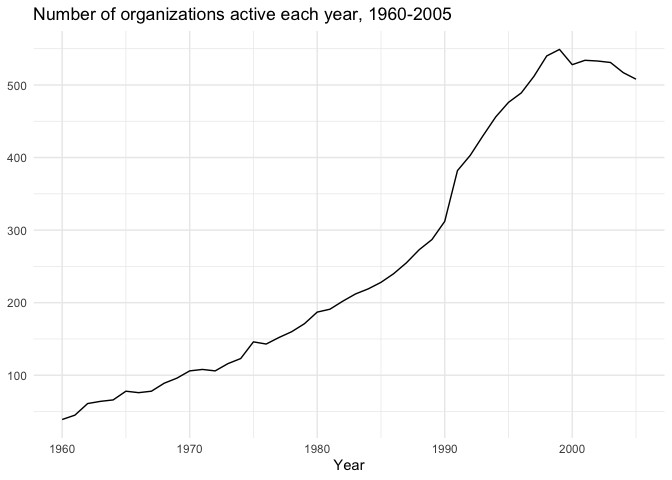

<!-- README.md is generated from README.Rmd. Please edit that file -->

# sRdpData

<!-- badges: start -->
<!-- badges: end -->

The goal of sRdpData is to provide you with easy, programmatic access to
data on all self-determination groups and organizations, the countries
that they are challenging, their start and end years, and their use of
violent and non-violent tactics. This package is part of the [Strategies
of Resistance Data
Project](http://www.kathleengallaghercunningham.com/data-projects.html).

## Installation

You can install the development version of sRdpData from
[GitHub](https://github.com/) with:

``` r
# install.packages("devtools")
devtools::install_github("hgoers/sRdpData")
```

## Access group- and organization-level data for all years between 1960 and 2005

``` r
library(sRdpData)

# Access organization-level data
srdp_orgs() # In organization-year dyads, or
#> # A tibble: 12,017 × 5
#>    kgcid group_name  facid fac_name          year
#>    <dbl> <chr>       <dbl> <chr>            <dbl>
#>  1   101 Tajiks     101001 Jam'iyat-i-Islam  1978
#>  2   101 Tajiks     101001 Jam'iyat-i-Islam  1979
#>  3   101 Tajiks     101001 Jam'iyat-i-Islam  1980
#>  4   101 Tajiks     101001 Jam'iyat-i-Islam  1981
#>  5   101 Tajiks     101001 Jam'iyat-i-Islam  1982
#>  6   101 Tajiks     101001 Jam'iyat-i-Islam  1983
#>  7   101 Tajiks     101001 Jam'iyat-i-Islam  1984
#>  8   101 Tajiks     101001 Jam'iyat-i-Islam  1985
#>  9   101 Tajiks     101001 Jam'iyat-i-Islam  1986
#> 10   101 Tajiks     101001 Jam'iyat-i-Islam  1987
#> # … with 12,007 more rows
srdp_orgs(wide = TRUE) # At the organization-level
#> # A tibble: 1,137 × 6
#> # Groups:   kgcid, group_name, facid [1,126]
#>    kgcid group_name               facid fac_name             start_year end_year
#>    <dbl> <chr>                    <dbl> <chr>                     <dbl>    <dbl>
#>  1   101 Tajiks                  101001 Jam'iyat-i-Islam           1978     2003
#>  2   101 Tajiks                  101002 SCDA (Supreme Counc…       1996     1996
#>  3   101 Tajiks                  101002 UIFSA                      1997     2003
#>  4   102 Berbers                 102001 Berber Cultural Mov…       1988     2003
#>  5   102 Berbers                 102002 Congress Mondial Am…       1995       NA
#>  6   102 Berbers                 102003 Coordinations of Ka…       2001     2004
#>  7   102 Berbers                 102004 Rally for Culture a…       1997       NA
#>  8   102 Berbers                 102005 Socialist Forces Fr…       1963       NA
#>  9   103 Chittagong Hill Peoples 103001 National Freedom Co…       2004     2004
#> 10   103 Chittagong Hill Peoples 103002 Pahari Chhatra Pari…       1991       NA
#> # … with 1,127 more rows

# Access group-level data in much the same way
srdp_groups() # In group-year dyads, or
#> # A tibble: 5,549 × 5
#>    kgcid group_name  year country     country_iso3c
#>    <dbl> <chr>      <dbl> <chr>       <chr>        
#>  1   101 Tajiks      1960 Afghanistan AFG          
#>  2   101 Tajiks      1961 Afghanistan AFG          
#>  3   101 Tajiks      1962 Afghanistan AFG          
#>  4   101 Tajiks      1963 Afghanistan AFG          
#>  5   101 Tajiks      1964 Afghanistan AFG          
#>  6   101 Tajiks      1965 Afghanistan AFG          
#>  7   101 Tajiks      1966 Afghanistan AFG          
#>  8   101 Tajiks      1967 Afghanistan AFG          
#>  9   101 Tajiks      1968 Afghanistan AFG          
#> 10   101 Tajiks      1969 Afghanistan AFG          
#> # … with 5,539 more rows
srdp_groups(wide = TRUE) # At the group-level
#> # A tibble: 142 × 6
#> # Groups:   kgcid, group_name, country [142]
#>    kgcid group_name              country     country_iso3c start_year end_year
#>    <dbl> <chr>                   <chr>       <chr>              <dbl>    <dbl>
#>  1   101 Tajiks                  Afghanistan AFG                   NA       NA
#>  2   102 Berbers                 Algeria     DZA                 1962       NA
#>  3   103 Chittagong Hill Peoples Bangladesh  BGD                 1971       NA
#>  4   104 Walloons                Belgium     BEL                   NA       NA
#>  5   105 Indigenous Peoples      Canada      CAN                   NA       NA
#>  6   106 Tibetans                China       CHN                   NA       NA
#>  7   107 Indigenous Peoples      Colombia    COL                   NA       NA
#>  8   108 Turkish Cypriots        Cyprus      CYP                   NA       NA
#>  9   109 Afars                   Ethiopia    ETH                   NA       NA
#> 10   110 Basque                  France      FRA                   NA       NA
#> # … with 132 more rows
```

## Get annual data on groups’ use of tactics

``` r
library(sRdpData)

srdp_tactics()
#> # A tibble: 12,017 × 19
#>    kgcid group_name  facid fac_name         year violence_state fatal_violence_…
#>    <dbl> <chr>       <dbl> <chr>           <dbl> <fct>          <fct>           
#>  1   101 Tajiks     101001 Jam'iyat-i-Isl…  1978 1              1               
#>  2   101 Tajiks     101001 Jam'iyat-i-Isl…  1979 1              1               
#>  3   101 Tajiks     101001 Jam'iyat-i-Isl…  1980 1              1               
#>  4   101 Tajiks     101001 Jam'iyat-i-Isl…  1981 1              1               
#>  5   101 Tajiks     101001 Jam'iyat-i-Isl…  1982 1              1               
#>  6   101 Tajiks     101001 Jam'iyat-i-Isl…  1983 1              1               
#>  7   101 Tajiks     101001 Jam'iyat-i-Isl…  1984 1              1               
#>  8   101 Tajiks     101001 Jam'iyat-i-Isl…  1985 1              1               
#>  9   101 Tajiks     101001 Jam'iyat-i-Isl…  1986 1              1               
#> 10   101 Tajiks     101001 Jam'iyat-i-Isl…  1987 1              1               
#> # … with 12,007 more rows, and 12 more variables: violence_org <fct>,
#> #   fatal_violence_org <fct>, violence_ingroup <fct>,
#> #   fatal_violence_ingroup <fct>, violence_outgroup <fct>,
#> #   fatal_violence_outgroup <fct>, economic_noncoop <fct>,
#> #   protest_demonstration <fct>, nvintervention <fct>, social_noncoop <fct>,
#> #   institutional <fct>, political_nocoop <fct>
```

## See how groups and organizations have changed over time

``` r
library(sRdpData)
library(tidyverse)
#> ── Attaching packages ─────────────────────────────────────── tidyverse 1.3.1 ──
#> ✓ ggplot2 3.3.5     ✓ purrr   0.3.4
#> ✓ tibble  3.1.6     ✓ dplyr   1.0.8
#> ✓ tidyr   1.2.0     ✓ stringr 1.4.0
#> ✓ readr   2.1.2     ✓ forcats 0.5.1
#> ── Conflicts ────────────────────────────────────────── tidyverse_conflicts() ──
#> x dplyr::filter() masks stats::filter()
#> x dplyr::lag()    masks stats::lag()

srdp_orgs() %>% 
  group_by(year) %>% 
  summarise(n = n()) %>% 
  ggplot(aes(x = year, y = n)) +
  geom_line() + 
  theme_minimal() + 
  labs(title = "Number of organizations active each year, 1960-2005",
       x = "Year",
       y = NULL)
```


